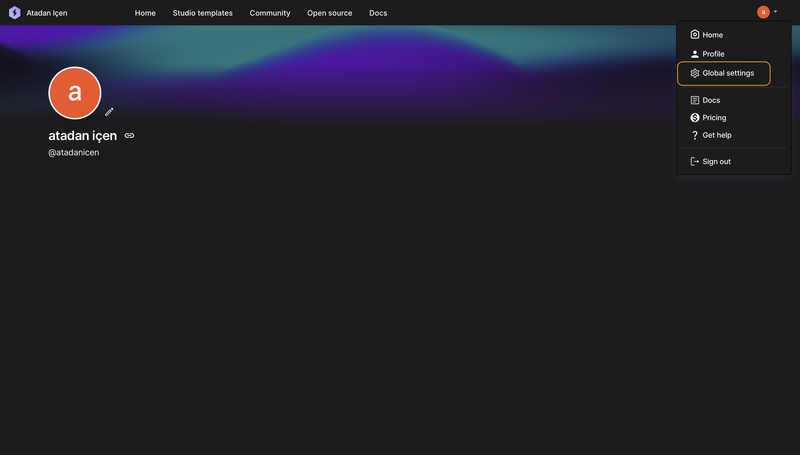
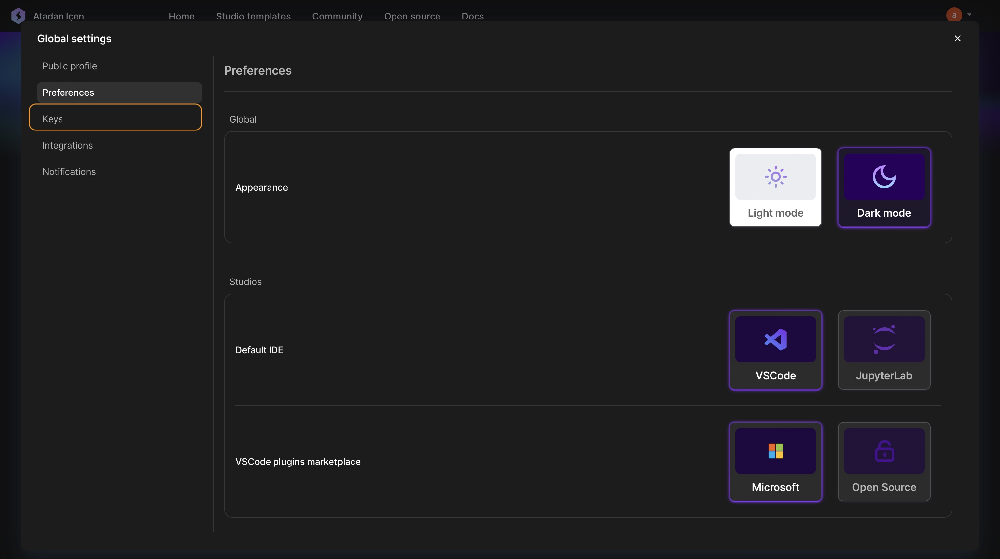
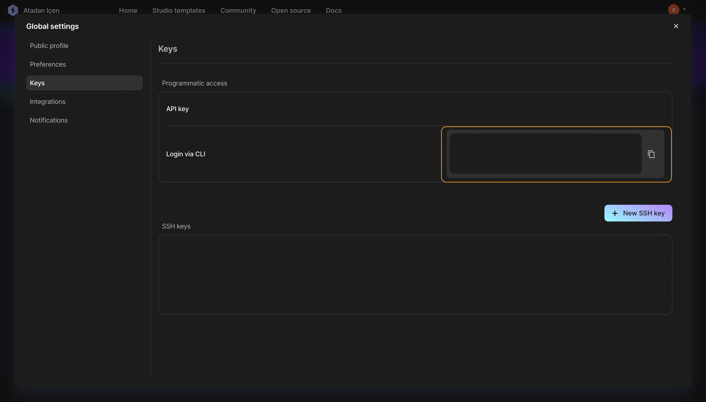
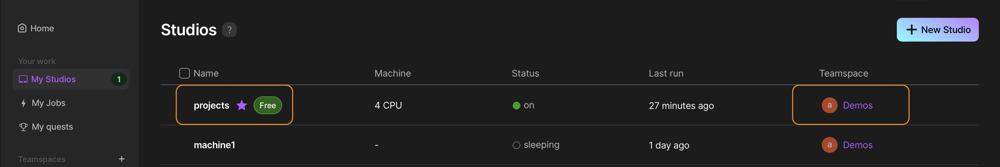

 # Lightning AI Studio RDS (Remote Development Server) Repository

Welcome to the Lightning AI Studio RDS repository! This project aims to streamline and enhance the experience of using Lightning AI as a remote development server. Whether you're a developer, data scientist, or researcher, this repository provides the tools and resources to seamlessly integrate Lightning AI into your remote development workflow.

# Installation Guide

Explore step-by-step instructions to set up Lightning AI RDS on your development environment.

1. Install the requirements
```
pip install requirements.txt
```
2. Establish your SSH connection by following the Lightning AI guide.
3. Setup your terminal.
 
    - Open your `.zshrc` or `.bashrc` file, and at the bottom of the file, append the following line.
        ```
        source ~/.scripts.sh export PATH="/usr/local/opt/llvm/bin:$PATH"
        ```
4. Please modify the required settings within the `scripts.sh` file.
5. To find your credentials, click on your profile picture in the top right corner and select `Global Settings`.

 - Then select Keys section on the left.
 
  - Copy the Login via CLI code block and then paste in to your terminal window.
 

6. Locate your studio information and make the necessary modifications in the `boot_rds.py` file.


# Configure the SFTP Setup
SFTP simplifies the process of uploading your files to the RDS
1. Install the `SFTP` extension from VS Code marketplace then configure the `SFTP.json` file.
```json
{
    "name": "lightning",
    "host": "ssh.lightning.ai",
    "protocol": "sftp",
    "port": 22,
    "username": "your_ssh_username",
    "remotePath": "/teamspace/studios/this_studio",
    "uploadOnSave": false,
    "useTempFile": false,
    "openSsh": false,
    "privateKeyPath": "your_ssh_private_key_path"
}
```
 - After that you can right click on your files in VS Code and upload them to RDS.
# Terminal commands
- **start_rds:** Starts the Lightning Studio (RDS).
- **ssh_rds:** It connects to the RDS terminal

### Smooth RDS launches await - no more laggy VS Code SSH connections! 🚀